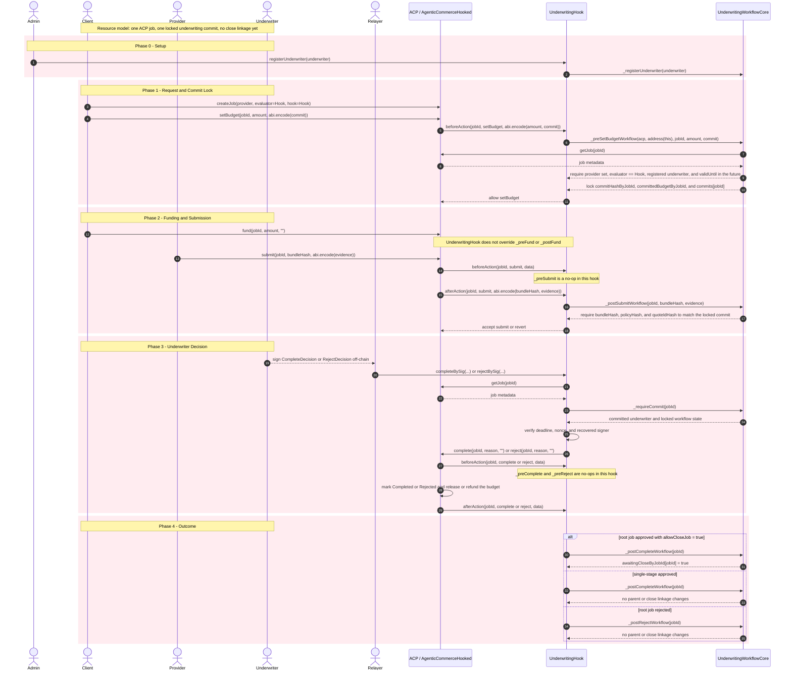
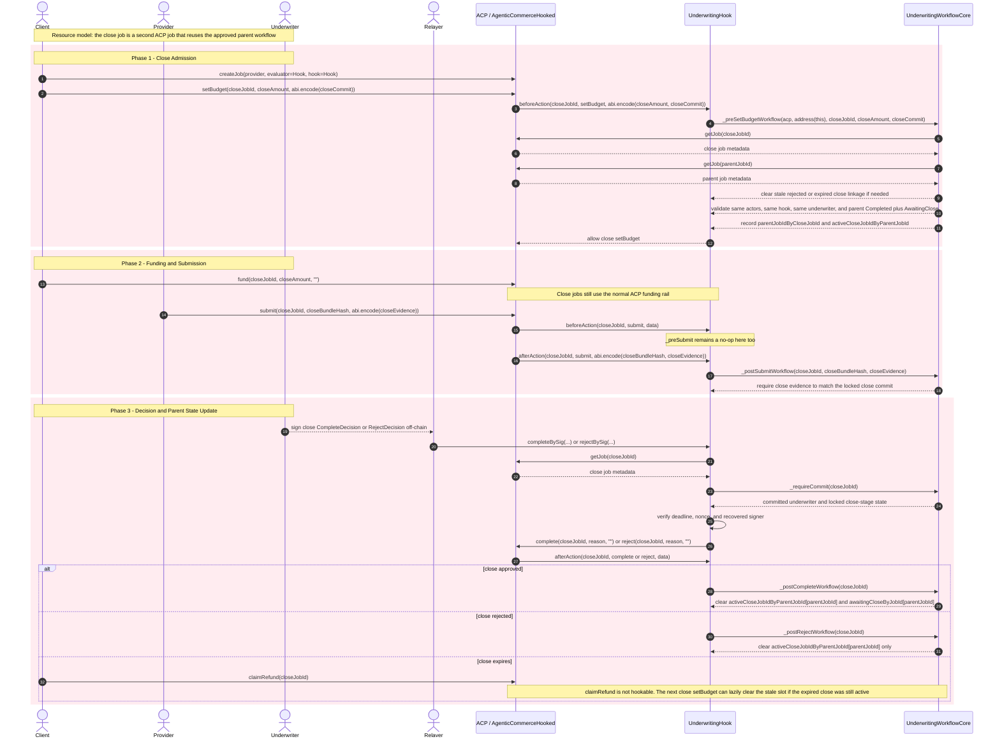

# Underwriting Hook ACP/Core Sequence

This document mirrors the phased sequencing style used in `ERC-ACP`, but it
stays limited to the contracts that actually exist in `hook-contracts`.

- `AgenticCommerceHooked` owns job status changes plus budget escrow, payout,
  and refund.
- `UnderwritingHook` is both the ACP hook and the EIP-712 evaluator relay.
- `UnderwritingWorkflowCore` is an internal module behind the hook, not a
  separate user-facing contract.
- Out of scope here: underwriting premium, provider collateral, client
  principal deployment, dispute windows, and settlement sidecars.

## Implementation-Level Sequence Diagrams

### Root Job Admission and Decision

`parentJobId = 0`. This is the exact callback and helper flow for a root
underwriting job.

### Close Job Extension

Precondition: the parent root job already completed and
`awaitingCloseByJobId[parentJobId] = true`.

## Scope Notes

- The ACP budget is still the only token amount moved by these contracts.
- `UnderwritingHook` never pulls premium, collateral, or principal.
- `UnderwritingWorkflowCore` should be read as commit and lineage state only.
