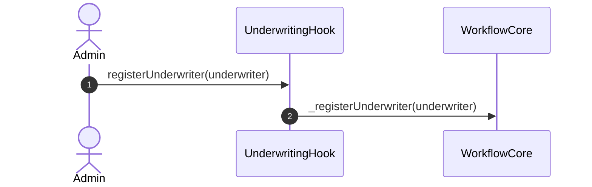
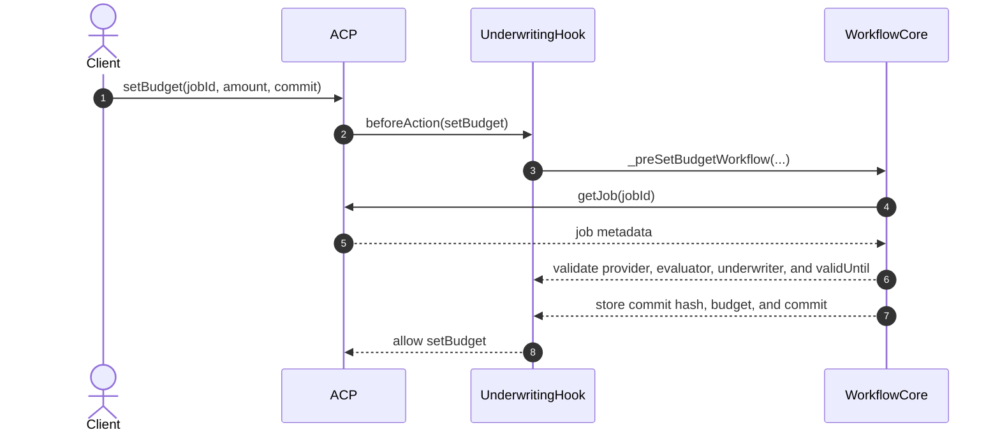
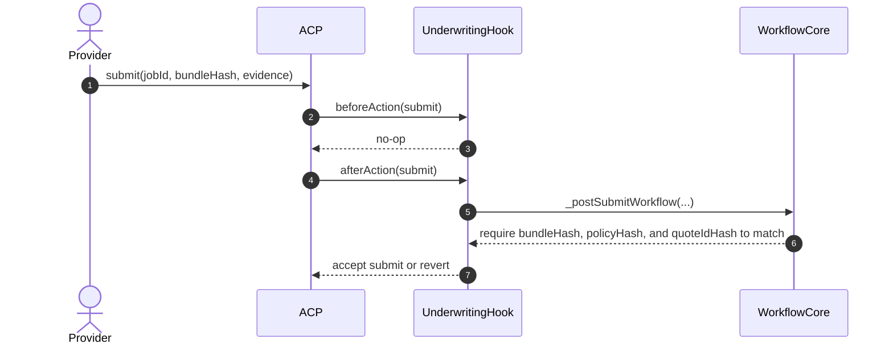
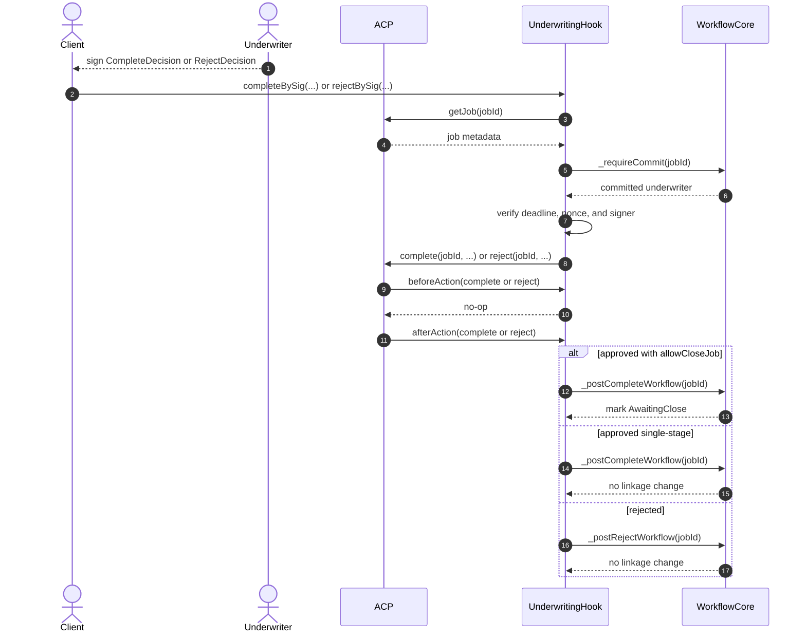
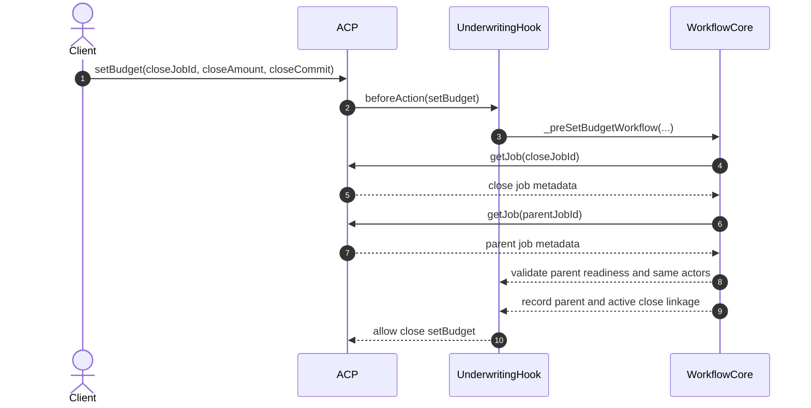
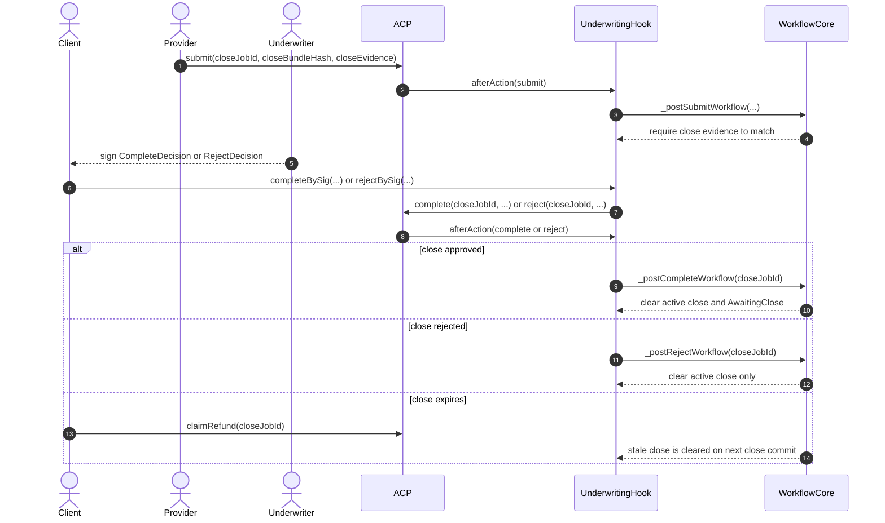

# Underwriting Hook ACP/Core Sequence

This document mirrors the phased sequencing style used in `ERC-ACP`, but it
stays limited to the contracts that actually exist in `hook-contracts`.

- `AgenticCommerceHooked` owns job status changes plus budget escrow, payout,
  and refund.
- `UnderwritingHook` is both the ACP hook and the EIP-712 evaluator relay.
- `UnderwritingWorkflowCore` is an internal module behind the hook, not a
  separate user-facing contract.
- Out of scope here: underwriting premium, provider collateral, client
  principal deployment, dispute windows, and settlement sidecars.

To keep GitHub rendering readable, this page splits the implementation flow into
smaller diagrams with fewer lanes and shorter labels.

## Implementation-Level Sequence Diagrams

### 1. Underwriter Setup

### 2. Root Job Commit Lock

The job is first created with `hook = Hook` and `evaluator = Hook`. The actual
underwriting admission happens on the first `setBudget(...)`.

### 3. Root Job Submission

`UnderwritingHook` does not implement `_preSubmit`, so the real underwriting
check runs after ACP records the submission.

### 4. Root Job Decision

For readability, this diagram shows the `Client` relaying the signature, though
any caller may relay `completeBySig(...)` or `rejectBySig(...)`.

### 5. Close Job Admission

Precondition: `awaitingCloseByJobId[parentJobId] = true`.

### 6. Close Job Submission and Outcome

## Scope Notes

- The ACP budget is still the only token amount moved by these contracts.
- `UnderwritingHook` never pulls premium, collateral, or principal.
- `UnderwritingWorkflowCore` should be read as commit and lineage state only.
