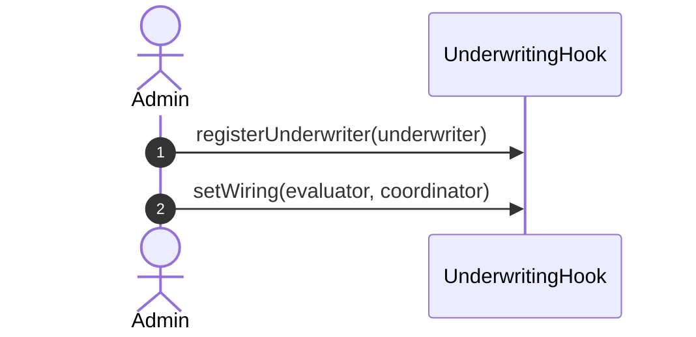
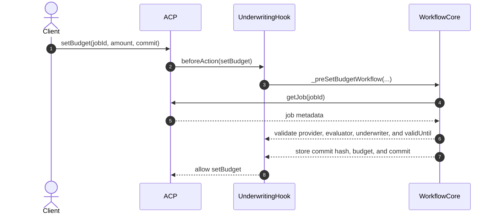
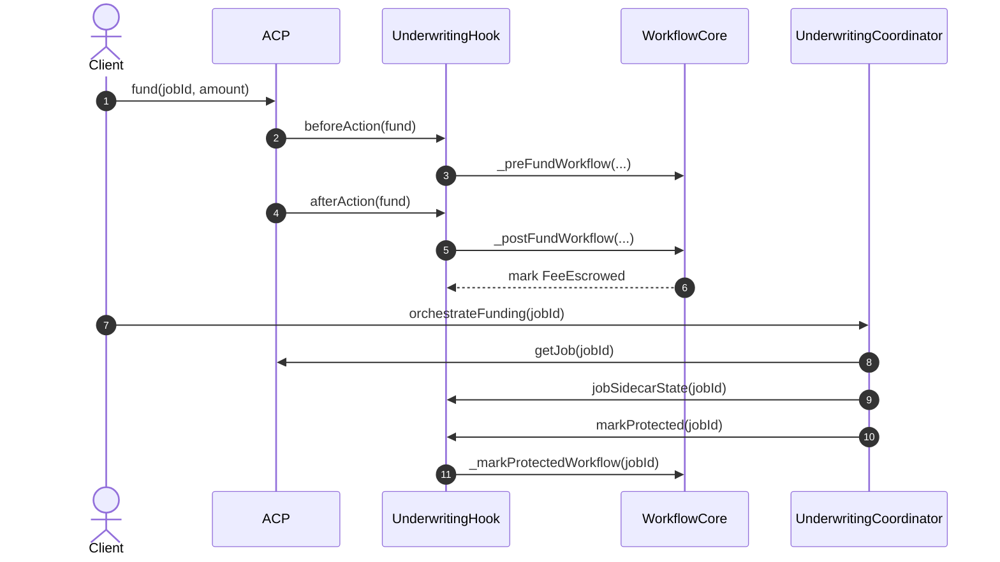
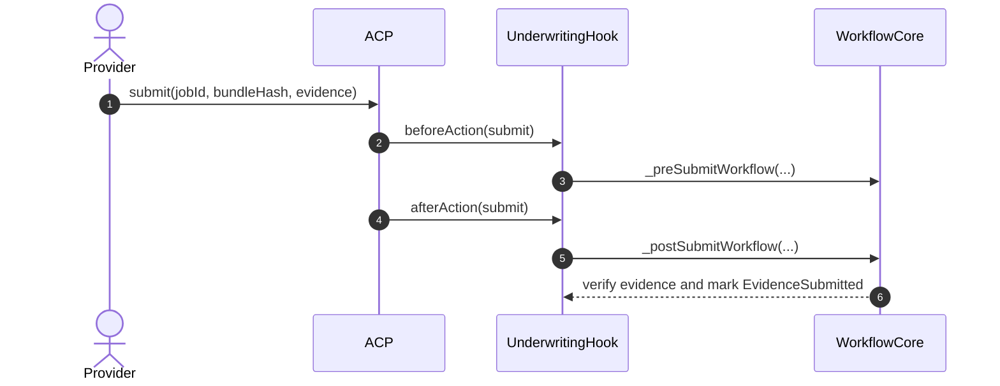
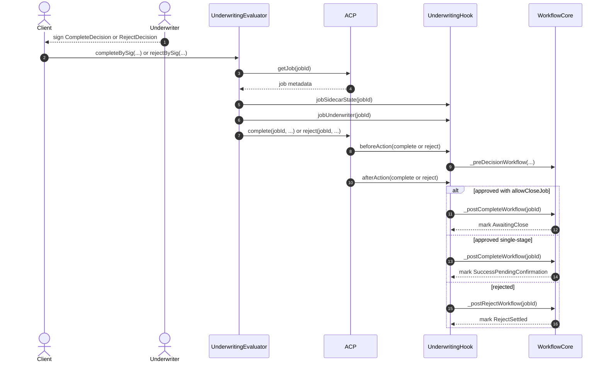
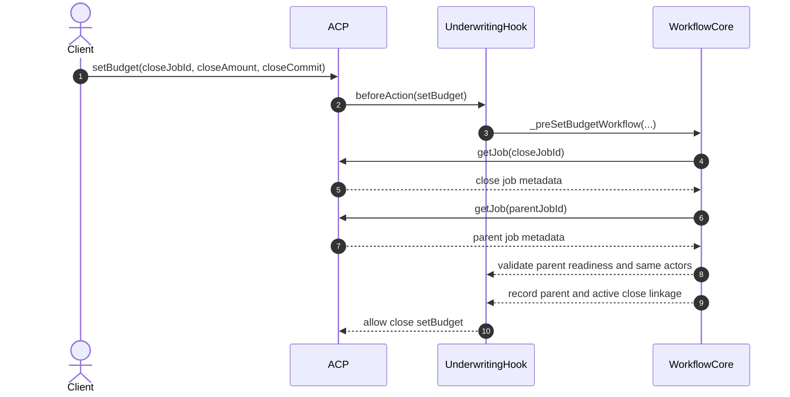
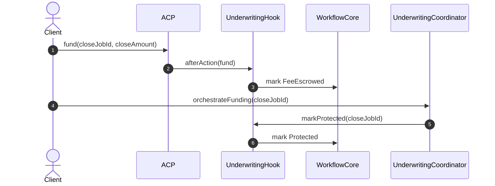
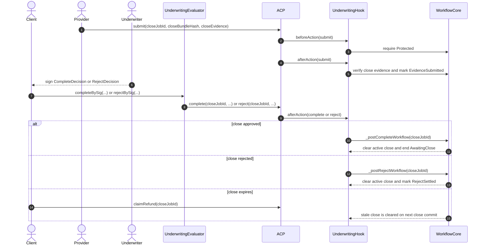

# Underwriting Hook ACP/Core Sequence

This document mirrors the phased sequencing style used in `ERC-ACP`, but it
stays limited to the contracts that actually exist in `hook-contracts`.

- `AgenticCommerceHooked` owns job status changes plus budget escrow, payout,
  and refund.
- `UnderwritingHook` is the ACP hook shell plus admin/view surface.
- `UnderwritingWorkflowCore` is the internal workflow and sidecar-state module
  behind the hook.
- `UnderwritingEvaluator` owns the EIP-712 decision relay and calls ACP
  `complete()` / `reject()`.
- `UnderwritingCoordinator` is the minimal scaffold that marks funded jobs
  `Protected` before submission.
- Out of scope here: underwriting premium, provider collateral, client
  principal deployment, dispute windows, and settlement sidecars.

To keep GitHub rendering readable, this page splits the implementation flow into
smaller diagrams with fewer lanes and shorter labels.

## Implementation-Level Sequence Diagrams

### 1. Underwriter Setup

### 2. Root Job Commit Lock

The job is first created with `hook = Hook` and `evaluator = Evaluator`. The
actual underwriting admission still happens on the first `setBudget(...)`.

### 3. Root Job Funding and Protection

The coordinator does not move tokens yet. It only advances the hook-owned
sidecar state from `FeeEscrowed` to `Protected`.

### 4. Root Job Submission

`UnderwritingHook` now blocks submission until the coordinator has marked the
job `Protected`.

### 5. Root Job Decision

For readability, this diagram shows the `Client` relaying the signature, though
any caller may relay `completeBySig(...)` or `rejectBySig(...)`.

### 6. Close Job Admission

Precondition: `awaitingCloseByJobId[parentJobId] = true`.
If the client rejects the close job while it is still `Open`, the hook marks it
`RejectSettled` and clears the reserved active-close slot.

### 7. Close Job Funding and Protection

### 8. Close Job Submission and Outcome

## Scope Notes

- The ACP budget is still the only token amount moved by these contracts.
- `UnderwritingCoordinator` is state-only in this scaffold and does not yet
  move premium, collateral, or principal.
- `UnderwritingWorkflowCore` should be read as commit, sidecar state, and
  lineage state only.
- A committed job may still be rejected while `Open`; this prevents abandoned
  root or close jobs from getting stuck before funding.
