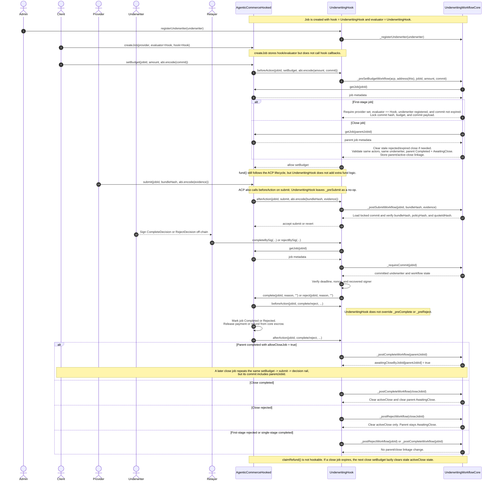

# Underwriting Hook ACP/Core Sequence

This sequence focuses on the on-chain interaction boundary between:

- `AgenticCommerceHooked` as the ACP core escrow rail
- `UnderwritingHook` as the ACP-facing hook and evaluator relay
- `UnderwritingWorkflowCore` as the hook-owned underwriting workflow state

It intentionally omits the larger MCU sidecars and shows only the callbacks and
state transitions that this underwriting example actually uses.

## Reading The Diagram

- `UnderwritingHook` is both the ACP `hook` and the ACP `evaluator`, so it can
  relay an off-chain underwriter signature into ACP `complete()` or `reject()`.
- `UnderwritingWorkflowCore` owns commit locking, evidence validation, and the
  optional parent/close linkage state, while ACP still owns escrow and status
  transitions.
- The optional close job is not a special ACP primitive. It is just another ACP
  job whose committed payload points back to the approved parent job.
- `claimRefund()` stays outside the hook callback surface, so expired close jobs
  are cleaned up lazily on the next close `setBudget(...)`.
