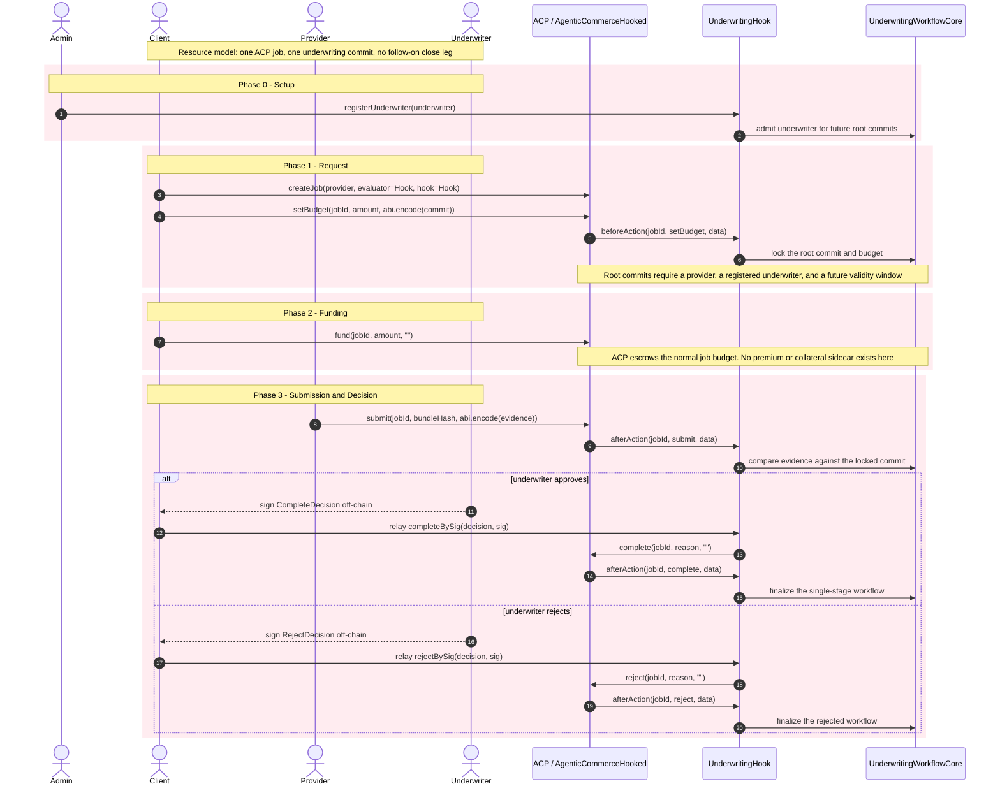
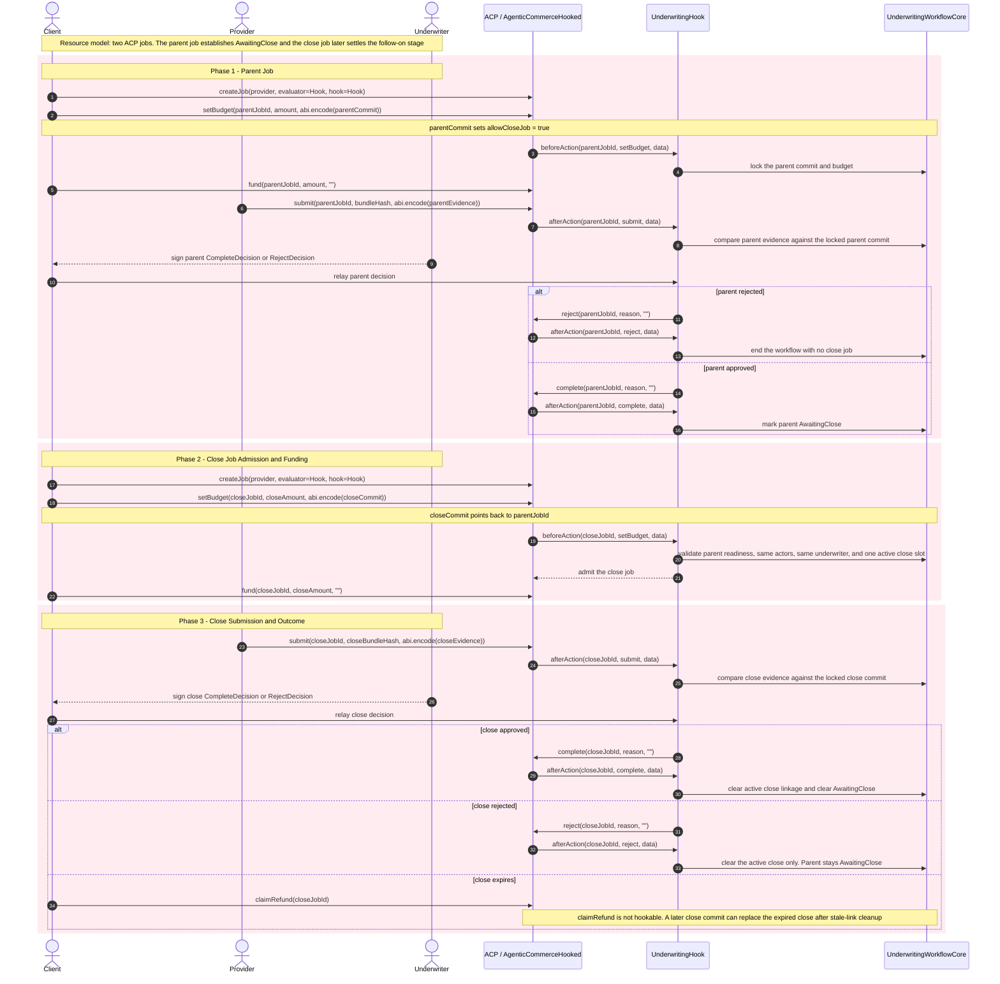

# Underwriting Hook Example Sequence

This document describes the workflow currently implemented by the underwriting
example in `hook-contracts`. It is meant to help reviewers understand what the
contracts do today, not to mirror the fuller MCU settlement system in
`ERC-ACP`.

- `AgenticCommerceHooked` remains the only escrow rail in this example.
- `UnderwritingHook` is the ACP-facing hook and evaluator relay.
- `UnderwritingWorkflowCore` is the internal underwriting workflow module behind
  the hook.
- This example does not implement underwriting premium, provider collateral,
  client principal deployment, dispute windows, or settlement sidecars.

## Business-Level Sequence Diagrams

### Single-Stage Job

`parentJobId = 0`. One ACP job carries request, budget funding, submission, and
the underwriter decision.

### ParentPlusClose Workflow

The first approved job sets `AwaitingClose` inside `UnderwritingWorkflowCore`.
A second ACP job later closes the workflow under the same actors and
underwriter.

## Scope Notes

- The ACP budget is the only on-chain fee bucket in this example.
- `UnderwritingWorkflowCore` tracks commit admission, evidence matching, and
  parent or close linkage only.
- Reviewers comparing this flow to `ERC-ACP` should not expect premium,
  collateral, principal deployment, or dispute settlement behavior here.
