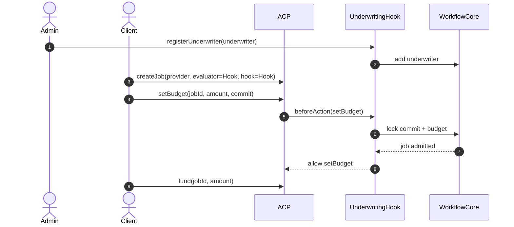
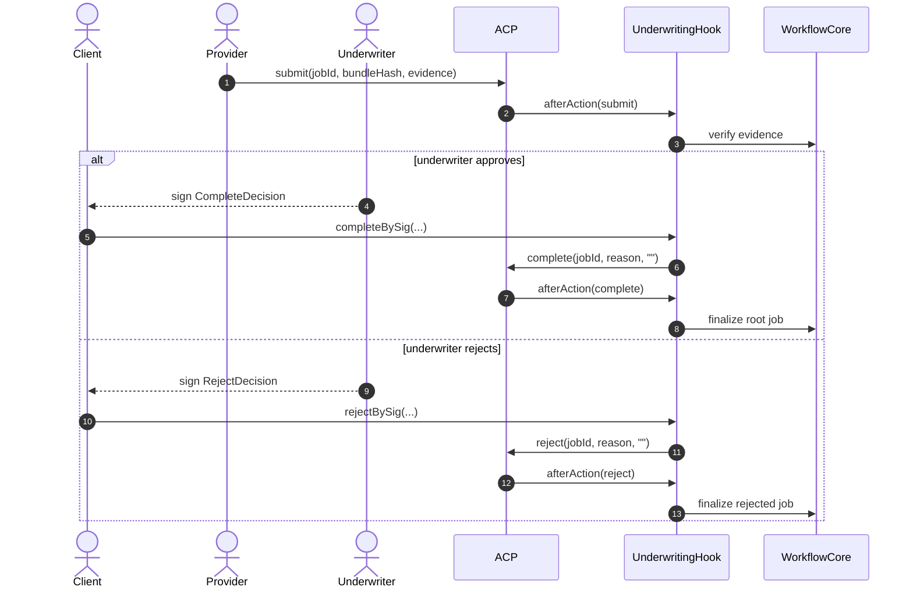
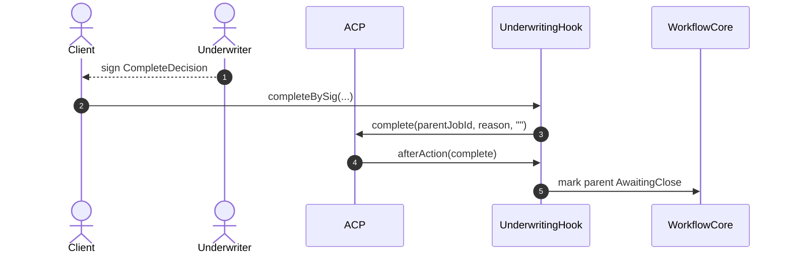
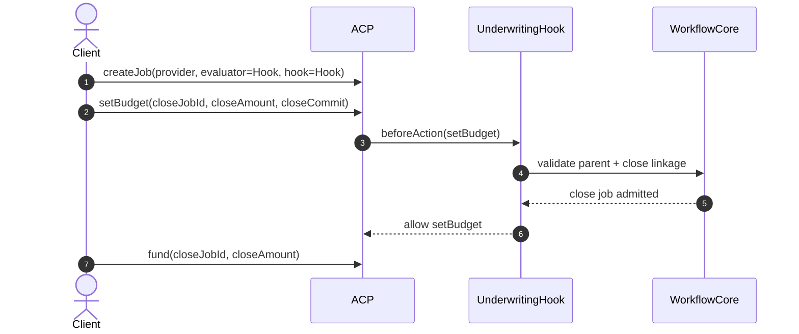
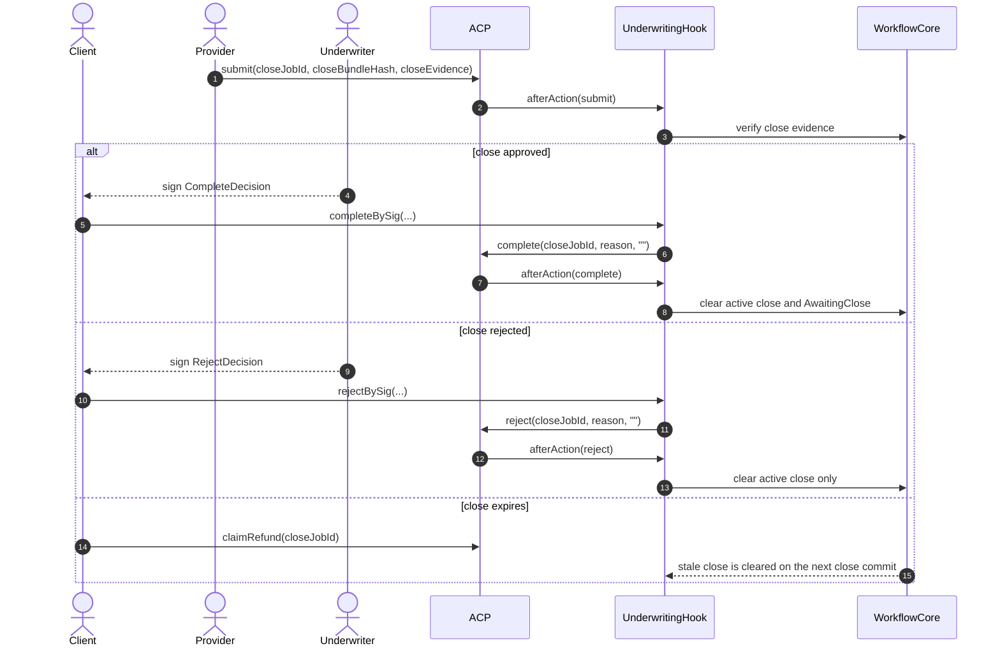

# Underwriting Hook Example Sequence

This document describes the workflow currently implemented by the underwriting
example in `hook-contracts`. It is meant to help reviewers understand what the
contracts do today, not to mirror the fuller MCU settlement system in
`ERC-ACP`.

- `AgenticCommerceHooked` remains the only escrow rail in this example.
- `UnderwritingHook` is the ACP-facing hook and evaluator relay.
- `UnderwritingWorkflowCore` is the internal underwriting workflow module behind
  the hook.
- This example does not implement underwriting premium, provider collateral,
  client principal deployment, dispute windows, or settlement sidecars.

To keep GitHub rendering readable, this page uses several smaller sequence
diagrams instead of one large all-in-one chart.

## Business-Level Sequence Diagrams

### Root Job Request and Funding

Applies to both a single-stage job and the first job in a `ParentPlusClose`
workflow.

### Root Job Submission and Decision

For readability, the diagrams show the `Client` relaying the underwriter
signature, although any caller may relay `completeBySig(...)` or
`rejectBySig(...)`.

### Parent Job Approval With `allowCloseJob`

This branch exists only when the first commit sets `allowCloseJob = true`.

### Close Job Admission and Funding

The close job is a second ACP job that points back to the approved parent job.

### Close Job Submission and Outcome

## Scope Notes

- The ACP budget is the only on-chain fee bucket in this example.
- `UnderwritingWorkflowCore` tracks commit admission, evidence matching, and
  parent or close linkage only.
- Reviewers comparing this flow to `ERC-ACP` should not expect premium,
  collateral, principal deployment, or dispute settlement behavior here.
