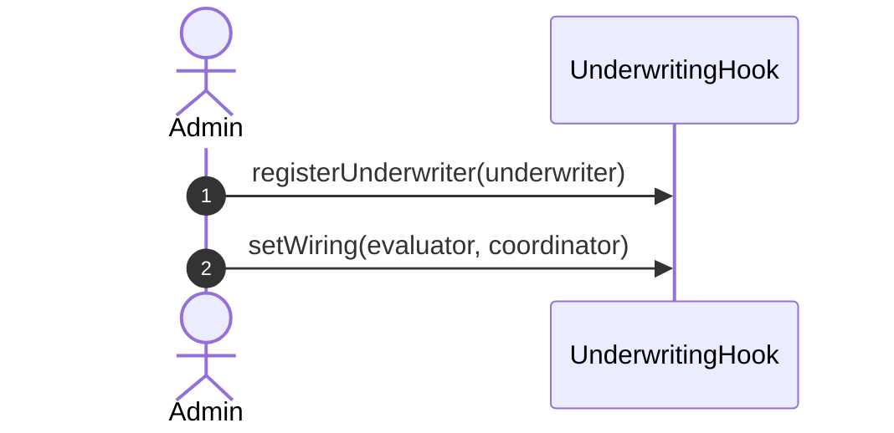
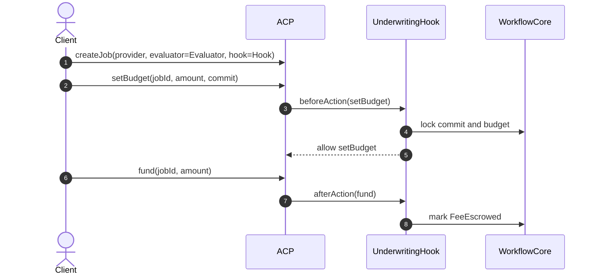
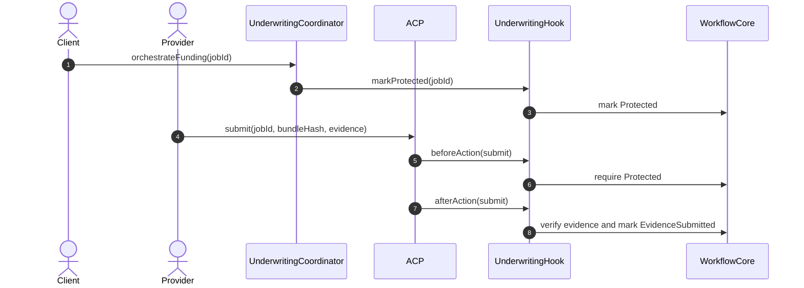
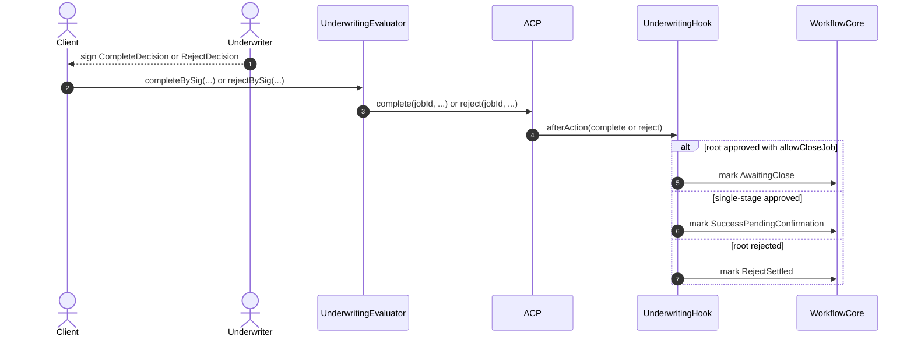
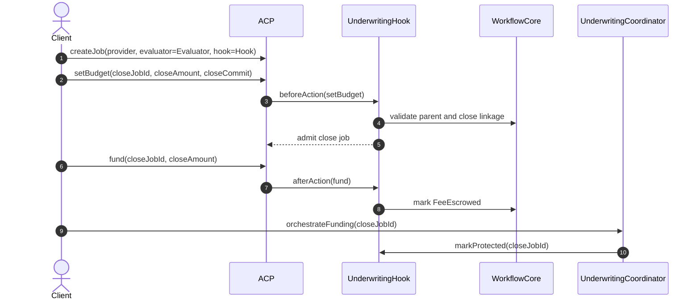
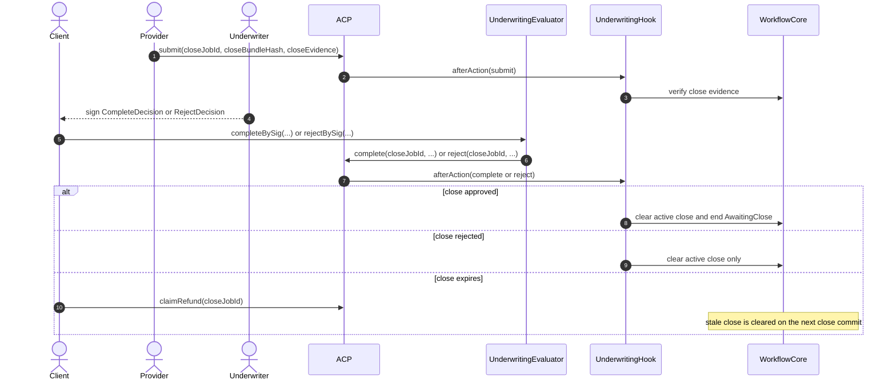

# Underwriting Hook Example Sequence

This document describes the current underwriting scaffold in `hook-contracts`.
It is still intentionally narrower than the fuller MCU settlement system in
`ERC-ACP`, but it now uses the same high-level split:

- `AgenticCommerceHooked` keeps the ACP job rail and fee escrow.
- `UnderwritingHook` is the ACP-facing hook shell plus admin/view surface.
- `UnderwritingWorkflowCore` is the internal underwriting workflow state behind
  the hook.
- `UnderwritingEvaluator` verifies underwriter signatures and calls ACP
  `complete()` / `reject()`.
- `UnderwritingCoordinator` advances funded jobs into the `Protected` sidecar
  phase before submission.

This scaffold still does **not** implement underwriting premium, provider
collateral, client principal deployment, dispute windows, or settlement sidecar
money movement.

To keep GitHub rendering readable, this page uses several smaller sequence
diagrams instead of one large all-in-one chart.

## Business-Level Sequence Diagrams

### 1. Setup

### 2. Root Job Request and Fee Funding

Applies to both a single-stage job and the first job in a `ParentPlusClose`
workflow.

### 3. Root Job Protection and Submission

### 4. Root Job Decision

For readability, the diagrams show the `Client` relaying the signature, though
any caller may relay `completeBySig(...)` or `rejectBySig(...)`.

### 5. Close Job Admission and Protection

The close job is a second ACP job that points back to the approved parent job.
If the client rejects that close job while it is still `Open`, the hook clears
the reserved close slot and the parent remains `AwaitingClose`.

### 6. Close Job Submission and Outcome

## Scope Notes

- The ACP budget is the only on-chain fee bucket in this scaffold.
- `UnderwritingWorkflowCore` tracks commit admission, sidecar state, evidence
  matching, and parent/close linkage only.
- A committed job may still be rejected while `Open`; that is the escape hatch
  for cancelling an abandoned root or close job before funding.
- Reviewers comparing this flow to `ERC-ACP` should not expect premium,
  collateral, principal deployment, or dispute settlement behavior here yet.
