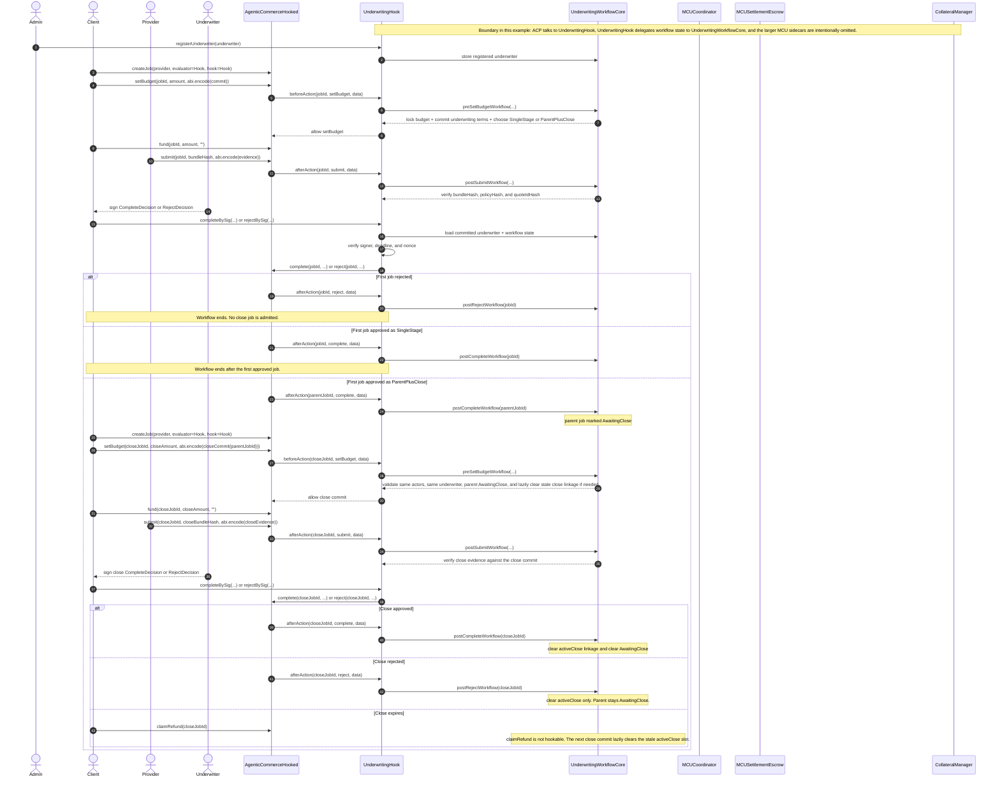

# Underwriting Hook Example Sequence

This diagram shows how the refactored underwriting example works with
`AgenticCommerceHooked`, and how it relates to the fuller MCU design in
`ERC-ACP`.

- `UnderwritingHook` is the ACP-facing shell and evaluator relay.
- `UnderwritingWorkflowCore` is the internal underwriting workflow module behind it.
- Every job still uses the standard ACP lifecycle:
  `createJob -> setBudget -> fund -> submit -> complete/reject`
- The full MCU sidecars are intentionally omitted here:
  `MCUCoordinator`, `MCUSettlementEscrow`, `CollateralManager`, and a separate
  `UnderwriterEvaluator`.

## Reading The Diagram

- The first committed job decides whether the flow is:
  - `SingleStage`, or
  - `ParentPlusClose` via `allowCloseJob = true`
- `AwaitingClose` only exists inside the hook-owned underwriting workflow
  state; ACP itself does not know about parent/close lineage.
- The top-level hook is intentionally thin: it adapts ACP callbacks and
  signature decisions, while `UnderwritingWorkflowCore` owns commit locking,
  lineage, and evidence/state transitions.
- That is a deliberate design choice: this example keeps parent/close linkage
  in the hook to minimize changes to the current ACP core and avoid turning one
  experimental underwriting workflow into a generic kernel-level linkage
  primitive.
- The underwriter decision is signature-based:
  the signer decides off-chain, and a caller relays that signature on-chain.
- Compared with the full MCU system in `ERC-ACP`, this example stops at the
  underwriting policy layer and does not include collateral, principal
  deployment, dispute windows, or settlement sidecars.
