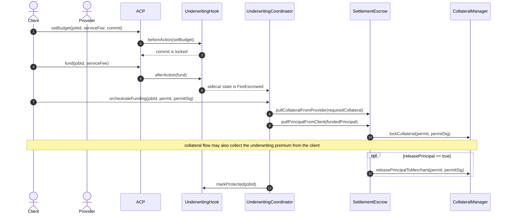
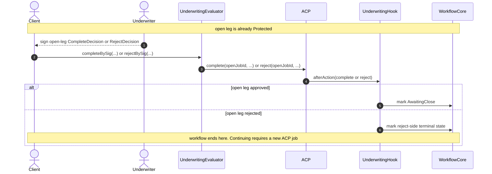
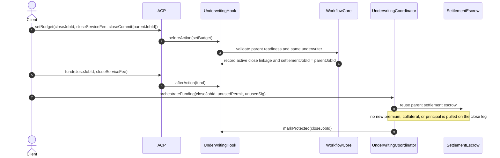
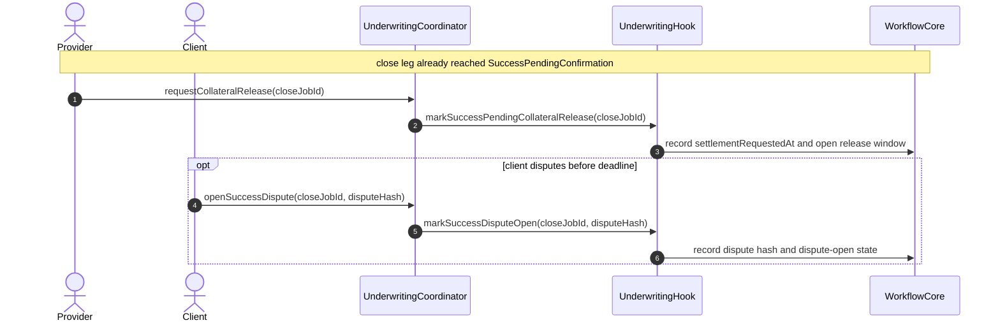
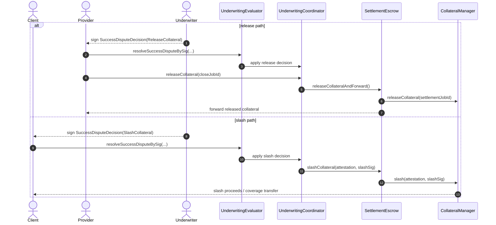

# Underwriting Hook Sidecar Sequence

This document is the reviewer deep dive for the broader sidecar-oriented
underwriting workflow. It explains how the current underwriting scaffold in
`hook-contracts` can connect to premium, collateral, principal, and dispute
settlement sidecars.

It is intentionally a deeper architecture view, not a claim that every
money-moving step below already exists in the current scaffold.

- `AgenticCommerceHooked` remains the ACP job rail and fee escrow.
- `UnderwritingHook` stays the ACP-facing hook shell plus admin/view surface.
- `UnderwritingWorkflowCore` stays the hook-owned workflow and sidecar-state
  module.
- `UnderwritingEvaluator` relays underwriter signatures into ACP decisions.
- `UnderwritingCoordinator` orchestrates the sidecar steps around protection and
  settlement.
- `SettlementEscrow` is the sidecar escrow that stages collateral and principal
  movement.
- `CollateralManager` is the sidecar settlement system that locks, releases, or
  slashes collateral and collects underwriting premium.

To keep GitHub rendering readable, this page uses several smaller sequence
diagrams instead of one large all-in-one chart.

## Sidecar Deep-Dive Sequence Diagrams

### 1. Premium and Protection Activation

This is the sidecar-oriented version of `setBudget -> fund -> orchestrateFunding`.

### 2. Open-Leg Underwriting Gate

This is the deeper sidecar view where the open leg can be approved or rejected
after protection is active but before final close-leg settlement exists.

### 3. Close-Leg Admission and Parent Reuse

The close leg reuses the parent workflow identity and protection context.

### 4. Provider Release Request and Client Dispute Window

The dispute window begins on the provider release request, not on ACP
completion itself.

### 5. Release vs Slash Outcome

After a release request, the sidecar path resolves toward collateral release or
collateral slash.

## Scope Notes

- This doc is a deeper sidecar-oriented architecture view for reviewers who
  want the premium/collateral/principal/dispute picture.
- The current `hook-contracts` scaffold does **not** yet implement the full
  sidecar money movement shown here.
- The current scaffold already has the split control-plane roles
  (`Hook`, `WorkflowCore`, `Evaluator`, `Coordinator`) that a future sidecar
  implementation can build on.
